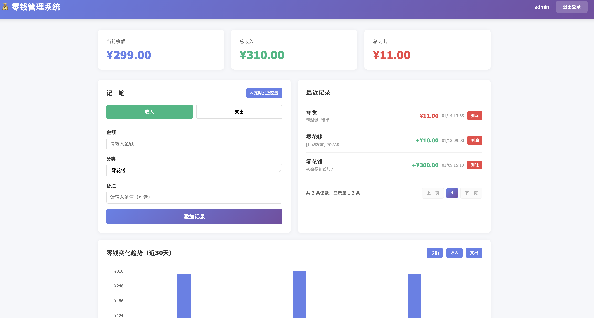

# 零钱管理系统

[](https://github.com/qinjie545/kids-pocketmoney/actions)
[](https://python.org)
[](https://opensource.org/licenses/MIT)
[](https://docker.com)

一个简单易用的BS模式零钱管理系统，支持零钱的增加、消费记账以及零钱变化趋势展示。

## 界面预览



*主控制面板 - 展示余额统计、交易记录和趋势图表*

## 功能特性

- 💰 零钱收入与支出记录
- 📊 实时余额统计
- 📈 零钱变化趋势图表
- 🔐 用户登录注册系统
- 💾 SQLite3 数据库存储
- ⏰ 定时发放配置（每天/每周/每月）
- 📄 分页查看交易记录（每页20条）
- 🐳 Docker 容器化部署支持

## 安装运行

### 方式一：Docker Compose 部署（推荐）

1. 使用 docker-compose 启动服务：
```bash
# 构建并启动服务
docker-compose up -d

# 查看日志
docker-compose logs -f

# 停止服务
docker-compose down
```

2. 访问系统：
   打开浏览器访问 `http://localhost:19754`

3. 默认登录账号：
   - 用户名：admin
   - 密码：admin123

**详细Docker部署说明请查看 [DOCKER.md](./DOCKER.md)**

### 方式二：本地开发运行

1. 安装依赖：
```bash
pip install -r requirements.txt
```

2. 初始化数据库：
```bash
python backend/database/init_db.py
```

3. 运行服务器：
```bash
python run.py
```

4. 访问系统：
   打开浏览器访问 `http://localhost:19754`

5. 默认登录账号：
   - 用户名：admin
   - 密码：admin123

## 项目结构

```
cash_manager/
├── backend/           # 后端代码
│   ├── app.py         # Flask 应用主文件
│   ├── scheduler.py   # 定时任务调度器
│   ├── __init__.py    # Python包初始化
│   ├── database/      # 数据库相关
│   │   ├── schema.sql      # 数据库结构
│   │   ├── init_db.py      # 数据库初始化脚本
│   │   └── cash_manager.db # SQLite 数据库文件（运行后生成）
│   └── test_*.py      # 测试文件
├── frontend/          # 前端代码
│   └── templates/     # HTML模板
│       ├── login.html      # 登录页面
│       └── dashboard.html  # 主控制面板
├── scripts/           # 工具脚本
│   ├── bump_version.py     # 版本管理脚本
│   └── pre_release_checklist.md # 发布检查清单
├── run.py             # 应用入口点
├── requirements.txt   # Python 依赖
├── pyproject.toml     # 项目配置
├── setup.py          # 包安装配置
└── Dockerfile         # Docker配置
```

## 技术栈

- 后端：Flask + SQLite3 + APScheduler
- 前端：HTML + CSS + JavaScript
- 部署：Docker + Docker Compose
- 图表：SVG 自定义图表

## Docker 部署

项目支持使用 Docker Compose 一键部署，详细说明请查看 [DOCKER.md](./DOCKER.md)

快速启动：
```bash
docker-compose up -d
```
